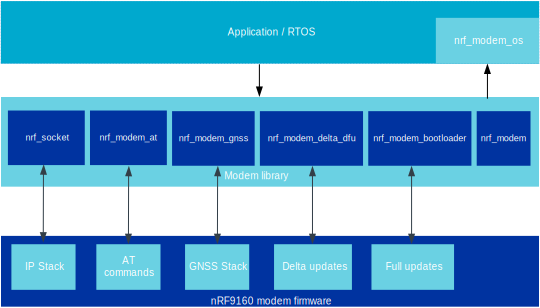

.. _architecture:

Library architecture
####################

The Modem library is the application interface to the nRF9160 modem firmware, which contains a full IP and DTLS/TLS stack as well as GNSS.
It provides the standard Socket APIs, to facilitate application development and additional APIs to manage the modem and perform full modem firmware updates.

The library implements a communication between the Application and Modem cores on the nRF9160 via the RPC protocol, using the Inter Processor Communication (IPC) peripheral and a shared region of RAM.

The following figure shows a simplified Modem library architecture.

   Modem library architecture diagram

Shared memory configuration
###########################

The Modem library implements a communication between the application core and the modem core using a shared memory area to exchange data.
The shared memory area may be located anywhere within the first 128 kilobytes of RAM (lowest addresses) and is logically divided in four regions: Control, TX, RX and Trace.
The size and location of these regions are configurable and are accepted by the library as a parameter to @ref nrf_modem_init via the @c shmem parameter.
The application can adjust the size of these region based on its requirements to minimize the library's RAM requirements.

Control area
~~~~~~~~~~~~
The control area contains data structures used to setup the communication between the two cores.
The size of this area is the only one that is fixed and it is exported in the @file nrf_modem_platform.h file.
For NCS users, the build system and glue implementation will take care of passing the correct size to the :c:func:`nrf_modem_init()` call automatically.

TX area
~~~~~~~
The TX area contains the data payload of messages sent to the modem.
The size of this area affects the largest buffer that :c:func:`nrf_send()` can send in one call, and more directly *it affects the size of the longest AT command that can be sent to the modem*.
When provisining TLS certificates, the size of this area should be large enough to accommodate for the TLS certificate plus the AT command with which it is provisioned.
The library OS abstraction layer defines two functions to allocate and free data in this memory region: @ref nrf_modem_os_shm_tx_alloc and @ref nrf_modem_os_shm_tx_free respectively.

RX area
~~~~~~~
The RX area is entirely managed by the Modem and contains all incoming data from the modem.
The size of this area affects how much incoming data from the modem can be buffered on the application core, including GNSS data, AT command responses and IP traffic.
An example of an operation which requires a large TX area is reading out a TLS certificate associated with a security tag.
The size of the TX area should be as large as the TLS certificate that is being read out, plus the AT command which is used to do so.

Trace area
~~~~~~~~~~
The trace area contains trace output from the modem core.
This area of memory is optional and its size may be configured to zero to disable the trace output.

Library heap
############

The Modem library needs to allocate memory dynamically to function (a heap).
This memory contains metadata that is only used internally by the library and is never exchanged with the modem, therefore, this memory can belong in the application's RAM instead of the shared memory regions.
The library OS abstraction layer defines two functions to allocate and free dynamic memory for the library: @ref nrf_modem_s_alloc and @ref nrf_modem_os_free respectively.
