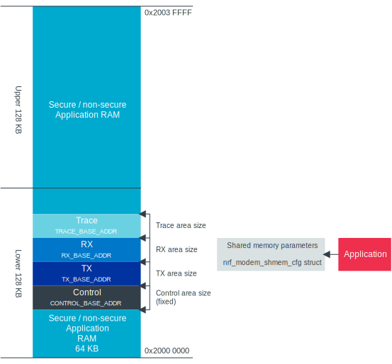

.. _nrf_modem_ug_porting:

Porting the Modem library to your OS
####################################

.. contents::
   :local:
   :depth: 2

The :ref:`nrf_modem` from Nordic Semiconductor is an OS-agnostic C library where OS-specific parts are moved out of the library.
To use the library with your OS or scheduler, you must first port it by creating a custom :file:`nrf_modem_os.c` file, which serves as an OS abstraction layer.
The library exposes a :file:`nrf_modem_os.h` header file that defines the functions that must be implemented in :file:`nrf_modem_os.c`.
The :file:`nrf_modem.h` header file exposes functions provided by the library that the OS integration module can interface with.

The following diagram presents the Modem library OS abstraction layer.
Arrows indicate that the elements can communicate with each other directly.

.. figure:: images/nrf_modem_layers.svg
   :alt: Modem library OS abstraction overview

   Modem library OS abstraction overview

Creating the OS abstraction layer
*********************************

To create an OS abstraction layer for the Modem library, you must implement the functions in the :file:`nrf_modem_os.h` file.
An OS abstraction layer implementation for the Zephyr RTOS is also available in the |NCS|.
See :file:`nrf_modem_os.c` for more details.
The implementation details for each function are shown in the section following and in the header file:

nrf_modem_os_init()
===================

This function is called by the Modem library when the application has issued :c:func:`nrf_modem_init`.
It is responsible for initializing OS-specific functionality related to the Modem library OS abstraction.

If Nordic Proprietary trace is enabled, the library generates trace data that can be retrieved using the :c:func:`nrf_modem_trace_get` function.
See :ref:`trace_handling` for more information.

*Required actions*:

* Initialize timers/threads.
* Configure low priority Modem library scheduling IRQ (SoftIRQ).
* Initialize heap memory.
* If Nordic Proprietary trace is enabled, initialize a trace thread and the trace backend (for example, UART or SPI).

nrf_modem_os_busywait()
=======================

This function is called by the Modem library when a blocking timed context is required.

.. _nrf_modem_os_timedwait:

nrf_modem_os_timedwait()
========================

This function is called by the Modem library when a timed context or sleep is required.
A blind return value of 0 will make all the Modem library operations always blocking.

*Required actions* to be taken that do not block the operations:

* Start counting the time (this can be based on a Timer or Thread for instance).
* In the case of a call to :c:func:`nrf_modem_os_event_notify` function, all waiting threads must wake up, reporting back the remaining time of the timer through the ``timeout`` variable.

The following points decide the *Function return value*:

* If the modem is not initialized, that is, if :c:func:`nrf_modem_is_initialized` returns false, function return value will be ``-NRF_ESHUTDOWN``.
* If there is a time out, function return value will be ``-NRF_EAGAIN``.
* In all other cases, function return value will be ``0``.

nrf_modem_os_event_notify()
===========================

This function is called by the Modem library when an event occurs and all threads waiting in :c:func:`nrf_modem_os_timedwait` function must wake up.

*Required action*:

Wake up all threads sleeping in the :c:func:`nrf_modem_os_timedwait` function.
See :ref:`nrf_modem_os_timedwait` for more details.

nrf_modem_os_alloc()
====================

This function is called by the library to allocate memory dynamically, and it is like a *malloc* call.
There are no specific requirements related to the location where this memory must be allocated in RAM.

nrf_modem_os_free()
===================

This function must free the memory allocated by :c:func:`nrf_modem_os_alloc`.

nrf_modem_os_shm_tx_alloc()
===========================

This function is called by the library to dynamically allocate the memory that must be *shared with the modem core*.
This function allocates memory on the TX memory region that is passed to the :c:func:`nrf_modem_init` function during the initialization.

nrf_modem_os_shm_tx_free()
==========================

This function releases the memory allocated by :c:func:`nrf_modem_os_shm_tx_alloc`.

nrf_modem_os_errno_set()
========================

This function translates errnos from the Modem library to the OS-defined ones.

*Required action*:

* Implement a translation for each errno set by the Modem library.
  If it overlaps with errnos of your OS, the translation is not needed.

nrf_modem_os_application_irq_set()
==================================

This function is called by the Modem library when the library wants to set a pending IRQ on the low priority scheduling IRQ of the Modem library.
See :ref:`application_interrupt` for more information.

*Required action*:

* Set a pending IRQ on the low priority scheduling IRQ of the Modem library using OS primitives or NVIC functions.

nrf_modem_os_application_irq_clear()
====================================

This function is called by the Modem library when the library wants to clear IRQ on the low priority scheduling IRQ of the Modem library.

*Required action*:

* Clear the low priority scheduling IRQ of the Modem library using OS primitives or NVIC functions.

nrf_modem_os_event_notify()
===========================

This function is called by the Modem library when an event occurs and all threads waiting in the :c:func:`nrf_modem_os_timedwait` function must wake up.

*Required action*:

* Wake all threads that are sleeping in :c:func:`nrf_modem_os_timedwait`. For details, see :c:func:`nrf_modem_os_timedwait`.

nrf_modem_os_is_in_isr()
========================

This function is called by the library to check whether or not it is executing in a interrupt context.

nrf_modem_os_sem_init()
=======================

This function is called by the library to allocate and initialize a semaphore.

*Required action*:

* Allocate and initialize a semaphore.
* If an address of an already allocated semaphore is provided as an input, the allocation part is skipped and the semaphore is only reinitialized.

.. note::

   Semaphores are not required if no multithreaded access to modem functionality is needed. In this case the implementation can blindly return 0.

nrf_modem_os_sem_give()
=======================

This function is called by the library to give a semaphore.

nrf_modem_os_sem_take()
=======================

This function is called by the library to take a semaphore.

nrf_modem_os_log()
==================

This function is called by the library to output logs.
This function can be called in an interrupt context.

nrf_modem_os_logdump()
======================

This function is called by the library to dump binary data.
This function can be called in an interrupt context.

Memory
******

The Modem library needs a region of RAM within the first lower 128KB to share with the modem.
To be accessible by both the modem and the application, this region of RAM must be configured as non-secure by the secure application.

The following RAM overview diagram shows the placement of Modem library in the sequential RAM, and it also indicates the configurable memory position values.

   Modem library memory overview

Peripheral requirements
***********************

As the Modem library has been compiled to operate on peripherals in the non-secure domain, the following two peripherals must be configured to be non-secure:

* NRF_IPC
* NRF_POWER

If you are using the hard-float variant of the Modem library, the FPU must be activated in both the secure domain and the non-secure domain, and must be configured to allow the non-secure application to run FPU instructions.

The :file:`nrfx/mdk/system_nrf9160.c` file provides a template on how to configure the FPU in both cases.
The system file also provides several Errata workarounds specific to the chip variant used, which are needed for any secure domain application.

IPC Driver and Interrupt
========================

#. The Modem library uses the nrfxlib IPC driver.
   The application must either include the nrfxlib IPC driver or implement its own IPC driver using the same signature as the nrfxlib IPC driver.

#. If the OS has its own IRQ handler scheme that does not directly forward the IPC_IRQHandler, the OS must route the IPC_IRQHandler to the nrfxlib IPC IRQ handler.

.. _application_interrupt:

Application Interrupt
=====================
The modem library receives events from the modem on the high-priority IPC interrupt. To continue processing these events on a lower priority, an application interrupt is used.
The library calls :c:func:`nrf_modem_os_application_irq_set` when the interrupt shall be triggered. The handler for the low-priority interrupt shall then call :c:func:`nrf_modem_application_irq_handler`.

How the application interrupt is implemented is up to the abstraction layer. Possible solutions for this are either directly setting an IRQ or using an EGU event.

Handling of a modem fault
*************************

On initialization of the Modem library, the application registers a modem fault handler through the initialization parameters.
If a fault occurs in the modem, the application is notified through the fault handler, which enables the application to read the fault reason (and in some cases the Modem's Program Counter) and take appropriate action.

The following are the three alternatives to how the application can handle the modem fault:

* The application logs the fault with no other action.
* Restart the application.
* Shutdown and reinitialize the modem and the Modem library.

.. _trace_handling:

Handling of modem traces
************************

Modem traces are retrieved by the application and output to a trace medium, typically UART.
Trace data is retrieved by calling :c:func:`nrf_modem_trace_get`.
For more information, see :ref:`modem_trace`.

Message sequence diagrams
*************************

The following message sequence diagrams show the interactions between the application, Modem library, and the OS.

#. Sequence of the initialization of the Modem library.
   Configuration of the high and low priority IRQs:

    .. figure:: images/nrf_modem_initialization_sequence.svg
        :alt: Initialization (main thread)

        Initialization (main thread)

#. Handling an event sent from the Modem library to a lower priority to be able to receive new events:

    .. figure:: images/nrf_modem_event_sequence.svg
        :alt: Event handling, lowering priority

        Event handling, lowering priority

#. Handling a timeout or sleep:

    .. figure:: images/nrf_modem_timers_sequence.svg
        :alt: Timedwait

        Timedwait

Reference template for the nrf_modem_os.c file
**********************************************

The following code snippet shows a simple implementation of the Modem library OS abstraction layer.
You can use it as a template and customize it for your OS or scheduler.

.. code-block:: c
   #include <nrf_modem.h>
   #include <nrf_modem_os.h>
   #include <nrf_errno.h>
   #include <nrf_modem_platform.h>
   #include <nrf_modem_limits.h>

   #include <nrf.h>
   #include "errno.h"

   /**
   * @brief Initialize the glue layer.
   */
   void nrf_modem_os_init(void) {
      
   }

   /**
   * @brief Deinitialize the glue layer.
   *
   * When shutdown is called, all pending calls to @c nrf_modem_os_timedwait shall exit
   * and return -NRF_ESHUTDOWN.
   */
   void nrf_modem_os_shutdown(void){

   }

   /**
   * @brief Allocate a buffer on the TX area of shared memory.
   *
   * @param bytes Buffer size.
   * @returns A pointer to the allocated memory buffer or @c NULL if allocation failed.
   */
   void *nrf_modem_os_shm_tx_alloc(size_t bytes){
   }

   /**
   * @brief Free a shared memory buffer in the TX area.
   *
   * @param mem Buffer to free.
   */
   void nrf_modem_os_shm_tx_free(void *mem){
   }

   /**
   * @brief Allocate a buffer on the library heap.
   *
   * @param bytes Buffer size.
   * @returns A pointer to the allocated memory buffer or @c NULL if allocation failed.
   */
   void *nrf_modem_os_alloc(size_t bytes){
   }

   /**
   * @brief Free a memory buffer in the library heap.
   *
   * @param mem Buffer to free.
   */
   void nrf_modem_os_free(void *mem){
   }

   /**
   * @brief Busy wait.
   *
   * @param usec Microseconds to busy wait for.
   */
   void nrf_modem_os_busywait(int32_t usec){
   }

   /**
   * @brief Put a thread to sleep for a specific time or until an event occurs.
   *
   * All waiting threads shall be woken by @c nrf_modem_event_notify.
   *
   * @param[in]      context   A unique identifier assigned by the library
   *                           to identify the context.
   * @param[in, out] timeout   Timeout in millisec or -1 for infinite timeout.
   *                           Contains the timeout value as input and the
   *                           remaining time to sleep as output.
   *
   * @retval 0 The thread is woken before the timeout expired.
   * @retval -NRF_EAGAIN The timeout expired.
   * @retval -NRF_ESHUTDOWN Modem is not initialized, or was shut down.
   */
   int32_t nrf_modem_os_timedwait(uint32_t context, int32_t *timeout){
      if (!nrf_modem_is_initialized()) {
         return -NRF_ESHUTDOWN;
      }

      // Wait for the timeout

      if (!nrf_modem_is_initialized()) {
         return -NRF_ESHUTDOWN;
      }
      return 0;
   }

   /**
   * @brief Notify the application that an event has occurred.
   *
   * This function shall wake all threads sleeping in @c nrf_modem_os_timedwait.
   */
   void nrf_modem_os_event_notify(void){
   }

   /**
   * @brief Set errno.
   *
   * @param errno_val errno to set.
   */
   void nrf_modem_os_errno_set(int errno_val){
   }

   /**
   * @brief Check if executing in interrupt context.
   *
   * @retval true If in interrupt context.
   * @retval false If not in interrupt context.
   */
   bool nrf_modem_os_is_in_isr(void) {
   }

   /**
   * @brief Initialize a semaphore.
   *
   * The function shall allocate and initialize a semaphore and return its address
   * as an output. If an address of an already allocated semaphore is provided as
   * an input, the allocation part is skipped and the semaphore is only reinitialized.
   *
   * @param[inout] sem The address of the semaphore.
   * @param initial_count Initial semaphore count.
   * @param limit Maximum semaphore count.
   *
   * @returns 0 on success, a negative errno otherwise.
   */
   int nrf_modem_os_sem_init(void **sem, unsigned int initial_count, unsigned int limit) {
      return 0;
   }

   /**
   * @brief Give a semaphore.
   *
   * @param sem The semaphore.
   *
   * @note Can be called from an ISR.
   */
   void nrf_modem_os_sem_give(void *sem){
   }

   /**
   * @brief Take a semaphore.
   *
   * @param sem The semaphore.
   * @param timeout Timeout in milliseconds.
   *		  @c NRF_MODEM_OS_FOREVER indicates infinite timeout.
   *		  @c NRF_MODEM_OS_NO_WAIT indicates no timeout.
   *
   * @note @a timeout shall be set to NRF_MODEM_OS_NO_WAIT if called from ISR.
   *
   * @retval 0 on success.
   * @retval -NRF_EAGAIN If the semaphore could not be taken.
   */
   int nrf_modem_os_sem_take(void *sem, int timeout){
      return 0;
   }

   /**
   * @brief Get a semaphore's count.
   *
   * @param sem The semaphore.
   * @returns Current semaphore count.
   */
   unsigned int nrf_modem_os_sem_count_get(void *sem){
      return 0;
   }

   /**
   * @brief Set the application IRQ, @c NRF_MODEM_APPLICATION_IRQ.
   */
   void nrf_modem_os_application_irq_set(void){
   }

   /**
   * @brief Clear the application IRQ, @c NRF_MODEM_APPLICATION_IRQ.
   */
   void nrf_modem_os_application_irq_clear(void){
   }

   /**
   * @brief Generic logging procedure.
   *
   * @param level Log level.
   * @param fmt Format string.
   * @param ... Varargs.
   */
   void nrf_modem_os_log(int level, const char *fmt, ...){
      va_list ap;
      va_start(ap, fmt);
      vprintf(fmt, ap);
      printf("\n");
      va_end(ap);
   }

   /**
   * @brief Logging procedure for dumping hex representation of object.
   *
   * @param level Log level.
   * @param str String to print in the log.
   * @param data Data whose hex representation we want to log.
   * @param len Length of the data to hex dump.
   */
   void nrf_modem_os_logdump(int level, const char *str, const void *data, size_t len){}
